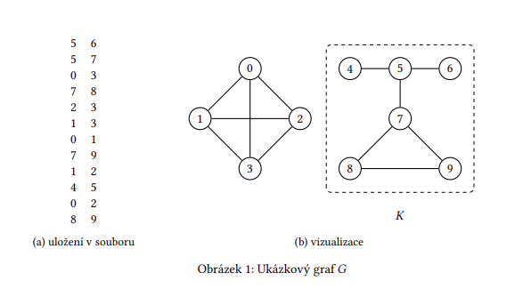

# Globální shlukovací koeficient grafu

## Problém

Máte dán neorientovaný graf *G*. Každý vrchol grafu *G* je označen celým nezáporným číslem. Vaším
úkolem v tomto zadání je:

1. Navrhnout vhodnou reprezentaci grafu *G* v paměti a umět načíst graf *G*, z textového souboru ve
výše uvedeném formátu, do této reprezentace.

2. Najít největší komponentu *K* v grafu *G*. Definici komponenty lze nalézt například v [1], kapitola 2.2.

3.  Vypočítat globální shlukovací koeficient *C* komponenty *K*. Jak tento koeficient vypočítat se dozvíte například zde [2], sekce Global clustering coefficient.

## Ukázka

Ukázkový graf *G* na obrázku 1 je tvořen dvěma komponentami. První komponenta obsahuje čtyři vrcholy {0, … , 3} a druhá komponenta obsahuje šest vrcholů {4, … , 9} a jde tedy o hledanou největší komponentu *K*. Pro komponentu *K* má globální shlukovací koeficient hodnotu

*C* = \frac{6}{16}

## Implementace

- Graf *G* je uložen v textovém souboru, kdy na každém řádku je vždy uložena dvojice celých nezáporných čísel *i* a *j* oddělených jednou mezerou. Čísla *i* a *j* představují vrcholy grafu mezi kterými
existuje hrana. Uložení ukázkového grafu  *G* v textovém souboru je opět vidět na obrázku 1.

-  Je nutné počítat s tím, že hrany mohou být uloženy v textovém souboru zcela nahodile, nelze
předpokládat, že jsou nějak systematicky uspořádány.

- Dále graf  *G* nemusí být nutně spojitý a může být i dosti rozsáhlý, tj. stovky tisíc vrcholů a miliony
hran.

- Vámi implementovanou aplikaci otestujte nejen na malém ukázkovém grafu z obrázku 1, ale i na
všech ostatních testovacích grafech.

- Výsledek vypište na standardní výstup.

## Odkazy

1.  KOVÁŘ, Petr. Teorie grafů. Ostrava, 2022. Dostupné také z: https://mi21.vsb.cz/modul/teorie-grafu.

2. Clustering coefficient [online]. San Francisco (CA): Wikimedia Foundation, 2001- [cit. 2023-03-01].
Dostupné z: https://en.wikipedia.org/wiki/Clustering_coefficient.
