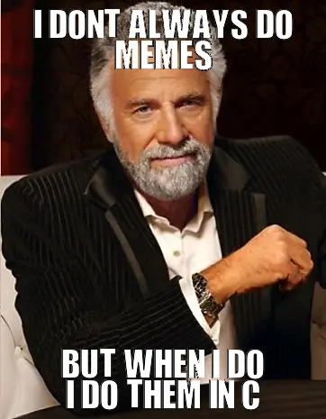

# Soubory a TGA
------------
Tento týden si zkusíte napsat program, který bude generovat meme obrázky ve formátu [TGA](https://mrlvsb.github.io/upr-skripta/c/aplikovane_ulohy/tga.html). Program obdrží cestu ke vstupnímu TGA obrázku, cestu ke složce s fontem a text, který se má do obrázku přidat. Program poté zadaný text do obrázku vykreslí a obrázek uloží na disk.

K dispozici máte jednoduchou [šablonu](/task/UPR/2022W/BER0134/ex08_meme/asset/template.tar.gz), ve které je kód pro načtení TGA obrázku ze skript, složka s fontem a dva obrázky na otestování vašeho programu. **Vzorový kód neobsahuje kontrolu chyb! Tu si musíte do kódu přidat sami.**

Program by se měl chovat takto:

1.  Program načte pomocí [parametrů příkazové řádky](https://mrlvsb.github.io/upr-skripta/ruzne/funkce_main.html#vstupn%C3%AD-parametry-funkce-main) tři parametry:
    
    *   Cestu ke vstupnímu TGA souboru (`i`)
    *   Cestu k výstupnímu TGA souboru (`o`)
    *   Cestu ke složce s fonty (`f`)
    
    Např.:
    
        $ ./meme-generator img1.tga out.tga font
    
    *   Pokud na vstupu programu nebudou všechny tři parametry, vypište řádek s hláškou `Wrong parameters` a ukončete program s kódem `1`.
2.  Program načte z `i` vstupní TGA soubor. Pokud při načtení dojde k chybě, vypište řádek s hláškou `Could not load image` a ukončete program s kódem `1`.
    
3.  Program načte ze složky s fonty (`f`) 26 TGA obrázků, jeden pro každý znak velké anglické abecedy. Soubory jsou pojmenovány `A.tga`, `B.tga`, `C.tga` atd. (viz složka `font` v [šabloně](/task/UPR/2022W/BER0134/ex08_meme/asset/template.tar.gz)). Pokud při načítání fontu dojde k chybě, program se ukončí s kódem `1`.
    
4.  Dále program načte ze vstupu řádek, který bude obsahovat dvě čísla (`top` a `bottom`) oddělená mezerou. `top` říká, kolik řádků textu se má vykreslit v horní části obrázku, `bottom` udává, kolik řádků textu se má vykreslit v dolní části obrázku. Dále program načte `top + bottom` řádků textu ze vstupu, které se postupně vykreslí do vstupního TGA obrázku. Příklad naleznete [níže](#p%C5%99%C3%ADklad).
    
    *   Řádek může obsahovat pouze znaky malé a velké anglické abecedy a mezery, ostatní znaky ignorujte. Malé znaky anglické abecedy před vykreslením převeďte na velké (dostupný font obsahuje pouze velké znaky).
    *   Každý řádek bude mít maximálně `100` znaků (včetně znaku odřádkování).
5.  Program vykreslí načtené řádky do vstupního obrázku (`top` řádků v horní části a `bottom` řádků v dolní části). Styl vykreslení je na vás, snažte se však co nejvíce přiblížit vzorovému [příkladu](#p%C5%99%C3%ADklad).
    
6.  Upravený vstupní TGA obrázek uložte na disk ve formátu TGA na cestu `o` zadanou v parametrech příkazové řádky. Při zápisu výstupního TGA souboru využijte hlavičku původního vstupního souboru! Bude to mnohem jednodušší než se snažit zrekonstruovat správnou hlavičku ručně.
    

### Vykreslování písmen fontu

Z hodnot `top` a `bottom` vypočtěte, na jakých pozicích se mají nacházet jednotlivé řádky z textu, a poté je vykreslete do vstupního TGA obrázku.

Jednotlivé TGA obrázky znaků fontu obsahují černé pozadí (`RGB (0, 0, 0)`) a bílé popředí. Při kopírování znaku do pixelů vstupního obrázku ignorujte černé pixely pozadí a kopírujte tedy jenom pixely, které nejsou černé. Jinak byste ve výsledném obrázku měli kolem každého znaku rušivý černý obdélník.

Předpokládejte, že výška každého znaku ve fontu je `34` pixelů (viz kód v šabloně), šířka je pro každý znak různá. Při vykreslování tak musíte brát v potaz šířku vykreslovaných znaků, aby se jednotlivé znaky nepřekrývaly.

### Poznámky

*   **Použití [VLA](https://mrlvsb.github.io/upr-skripta/c/pole/staticka_pole.html#konstantn%C3%AD-velikost-statick%C3%A9ho-pole) je zakázáno**.
*   V implementaci úlohy si vhodně nadefinujte si vlastní datové typy, např. pro reprezentaci TGA obrázku v paměti, ať se vám s obrázky dobře pracuje. Vytvořte také sadu funkcí pro manipulaci s TGA obrázkem, ať nemáte veškerý kód ve funkci `main`.
*   Nemusíte podporovat černobílé TGA obrázky ani TGA obrázky s průhledností (RGBA). Pro tuto úlohu předpokládejte, že všechny TGA obrázky mají barevnou hloubku 24 bitů (RGB) a že jejich souřadný systém začíná v levém horním rohu (tj. neřešte 5. bit v deskriptoru ani origin/offset hodnoty v hlavičce).
*   Při práci s řetězci či pixely budete narážet na paměťové chyby. Používejte [Address sanitizer](#address-sanitizer)! Při řešení této úlohy bude velmi užitečné využít [debugger](https://mrlvsb.github.io/upr-skripta/prostredi/ladeni.html#krokov%C3%A1n%C3%AD) VSCode. I při ladění/krokování si můžete na vstup programu [přesměrovat](https://code.visualstudio.com/docs/editor/debugging#_redirect-inputoutput-tofrom-the-debug-target) soubor, abyste nemuseli vstup neustále psát ručně.

Délka referenčního řešení: ~190 řádků (včetně kódu ze šablony)

### Příklad

*   Spuštění programu (obrázek `img1.tga` můžete naleznout v šabloně):
    
        $ ./meme-generator img1.tga out.tga font
        2 2
        I dont always do
        memes
        but when i do
        i do them in C
    
    Ukázkový výstup (soubor `out.tga`):
    
    
    
*   Spuštění programu (obrázek `img2.tga` můžete naleznout v šabloně):
    
        $ ./meme-generator img2.tga out.tga font
        0 1
        you to read skripta
    
    Ukázkový výstup (soubor `out.tga`):
    
    
    

### Užitečné funkce

*   [`fgets`](https://devdocs.io/c/io/fgets) - načtení řádku ze vstupu do řetězce (pole znaků).
*   [`atoi`](https://devdocs.io/c/string/byte/atoi) - převedení řetězce obsahujícího číslice na celé číslo (`int`).
*   [`snprintf`](https://devdocs.io/c/io/fprintf) - vypsání formátovaných dat do řetězce v paměti.

### Bonusový úkol (+1b)

Vykreslete text do obrázku tak, aby byl vycentrovaný (viz příklady nahoře). Pohrajte si s grafickým stylem vykreslení, zkuste např. dát každému vykreslenému znaku jinou barvu.
